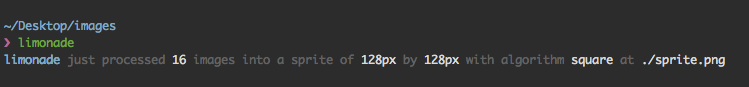

[](http://github.com/badges/stability-badges)

# limonade
Very minimal cli tool to generate sprite sheets for animations.


## Installation
npm but not yet

## Usage
From terminal or npm script.
```bash
Usage:
  limonade [input] [output]

Params:
  input   input folder to be scanned for images
  output  output folder where the spritesheet will be saved

Options:
  -h, --help        show help
  -v, --version     show version
  -f, --filename    name of the spritesheet without extension
  -a, --algorithm   packing algorithm: `square`, `horizontal` or `vertical`
```

## What it does
* It will pack a bunch of images together ideally for animation
* It will work with jpg, png of gifs
* It always order the images alphanumerically.
* It will only work if all images are the same size.

## What it doesn't do
* It won't try to fill the blanks
* It doesn't generate css or json files.
